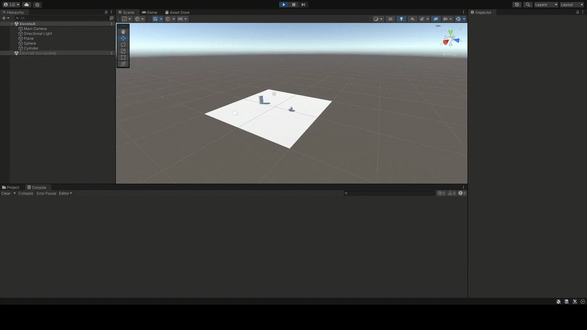
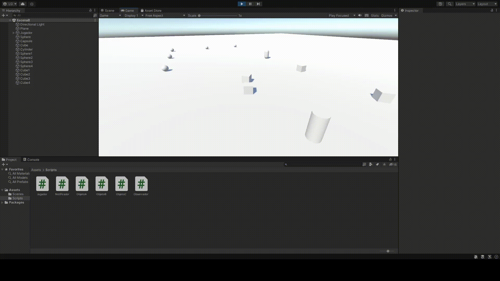
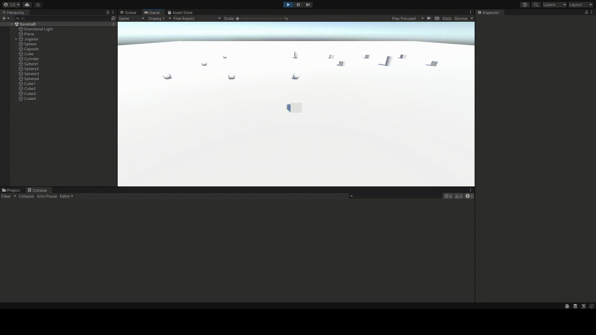
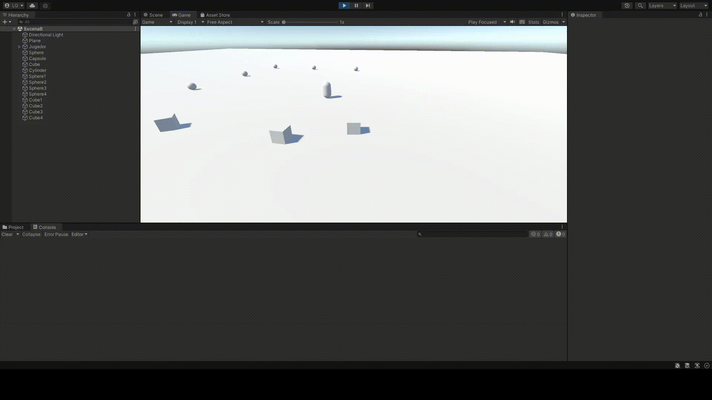
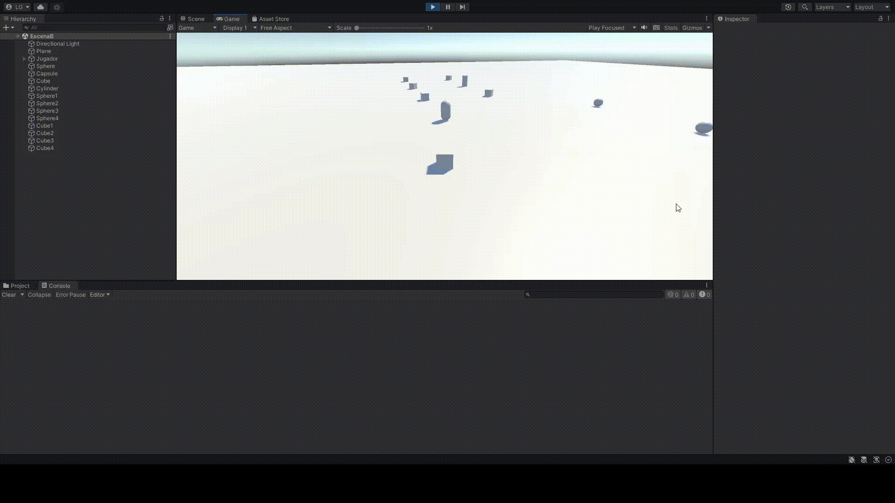

# Práctica 3: Delegados, Eventos
## Autor: Lorenzo Gabriel Pérez González

## 1. Crear una escena simple en Unity, con dos objetos: Notificador y Suscriptor y prueba el código en las transparencias.
En este ejercicio, he creado un plano y dos objetos (un cilindro y una esfera). Posteriormente, añadí los códigos señalados. El código de *Notificador.cs* se lo añadí a la esfera y el código de *Observador.cs* se lo añadí al cilindro. La ejecución es la siguiente:

## 2. Crear una escena en Unity, con objetos de tipo A, B y un único objeto C con los siguientes comportamientos:
- **Objeto A**: Esferas.
- **Objeto B**: Cubos.
- **Objeto C**: Cápsula.
### a1. Cuando el jugador colisiona con un objeto de tipo B, los objetos A se acercan al objeto C.
En este apartado, añadí un script *Jugador.cs* que contiene un **CharacterController** para que el jugador pueda moverse y una configuración similar a la del script *Notificador.cs*, de forma que sea capaz de lanzar eventos que, posteriormente, el objeto A escuchará y realizará la acción para acercarse al objeto C. Para llevar a cabo dicha acción, el script *ObjetoA.cs* contiene una estructura similar a la del script *Observador.cs*, que permitirá añadir al jugador como objeto observado. En caso de que surja el evento, se acercará al objeto C con el código que reside en la función *acercarC()*.

### a2. Cuando el jugador toca algún objeto A se incrementa el tamaño de cualquier objeto B.
De la misma forma que en el apartado anterior, el jugador es aquel que actúa como notificador. Tan solo tuve que ampliar el código de forma que, si colisiona con un objeto A, lanzará el evento que, el objeto B será capaz de observar. Esto lo he conseguido mediante el script *ObjetoB.cs*, que tiene una estructura de observador. Si observa el evento, ejecutará la función *agrandarB()*.

### b1. Cuando el jugador se aproxima al objeto de tipo C, los objetos de tipo A cambian su color y saltan.
En este apartado, convertí al objeto C en un objeto notificador de eventos. De esta manera, añadí un script *ObjetoC.cs* que tiene capacidad para detectar cuando el jugador se le acerca (usando un Trigger). En caso de que el jugador se acerque, genera un evento que, posteriormente, observará el objeto A. Para ello, el script *ObjetoA.cs* ha sido modificado para asignar el objeto C como un notificador y, en caso de observarse un evento que proviene de dicho objeto, se ejecutarán dos funciones: *color()* y *salto()*.

### b2. Cuando el jugador se aproxima al objeto de tipo C, los objetos de tipo B se orientan hacia un objetivo ubicado en la escena con ese propósito.
De forma similar al apartado anterior, el script *ObjetoB.cs* se modifica de forma que el objeto B sea un observador del objeto C. En caso de que éste lance un evento, el objeto B lo observará y ejecutará la función *orientarObjetivo()*, que hará que los objetos B apunten a un cilindro establecido en la escena.

### c. Buscar información de Debug.DrawRay y utilízala para depuración.
La función *Debug.DrawRay* permite dibujar un "rayo de luz" desde un punto inicial hacia una dirección señalada en forma de *Vector3*. Además, se puede decidir el color y la duración del rayo. Esta función es especialmente útil para que, de forma visual, pueda comprobarse si las direcciones de los vectores que se usan en el proyecto son correctas.

